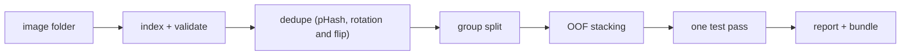
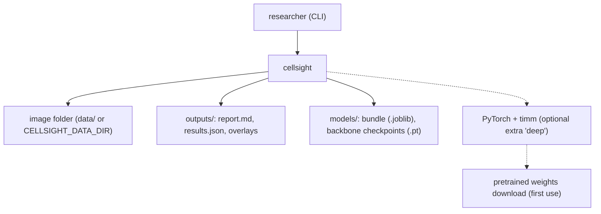
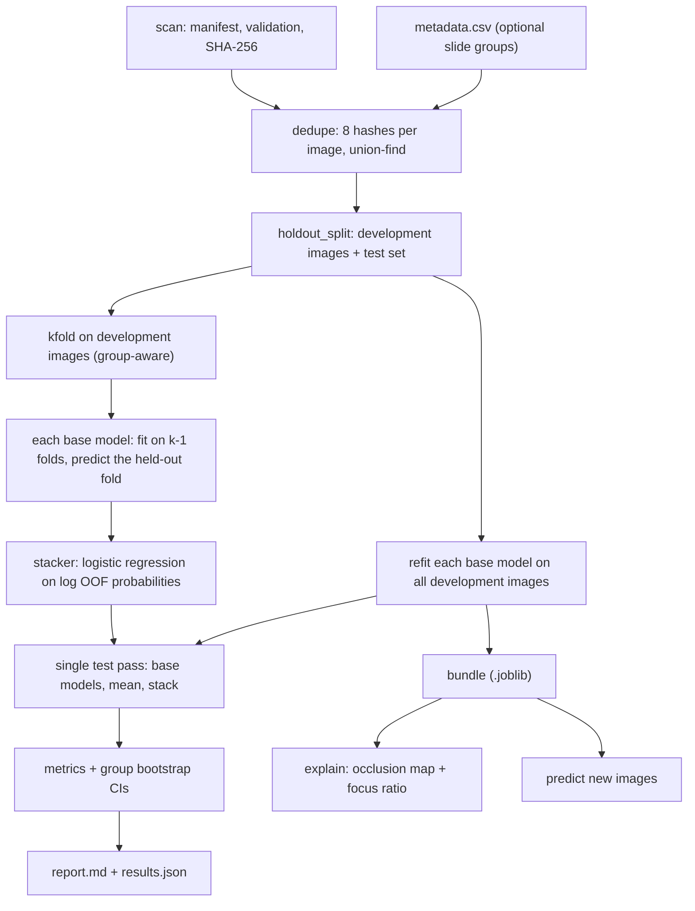

<div align="center">

# cellsight — Leakage-Safe Blood-Cell Image Ensemble

**cellsight is a blood-cell image classifier with an honest evaluation for five cell types. It takes an image folder through these steps to a stacked ensemble and a report:**

`index` → `dedupe` → `group split` → `out-of-fold stacking` → `single test pass` → `explain`.


**[Summary](#1-summary)** ·
**[Workflow](#4-the-end-to-end-workflow)** ·
**[Run it](#10-how-to-run-cellsight)** ·
**[Configuration](#104-environment-variables)** ·
**[Known problems](#13-known-problems)** ·
**[Glossary](#15-glossary)**

</div>

> [!NOTE]
> This README uses ASD-STE100 Simplified Technical English. The writing rules and the project
> vocabulary are in [`docs/ste-style-guide.md`](docs/ste-style-guide.md). Each term in the
> [Glossary](#15-glossary) has only one meaning.

---

cellsight classifies microscope images of single blood cells into basophil, erythroblast, monocyte, myeloblast and segmented neutrophil. The main idea is an evaluation that cannot leak. It finds augmented copies of one cell before the split, keeps each copy group on one side, and fits the stacker only on out-of-fold predictions. The test set gets one prediction pass at the end.

This README is the **one location that explains all of cellsight**. It gives these topics:

- the general design
- each component and its procedure, step by step
- the decision rules
- the data map
- the runbook
- the validation results and the known problems

| If you are… | Read |
|---|---|
| A manager or reviewer | [1](#1-summary), [3](#3-design-rules), [4](#4-the-end-to-end-workflow), [12](#12-validation-results), [14](#14-key-points) |
| A developer who joins the project | All sections, in sequence. Keep [10](#10-how-to-run-cellsight) and [13](#13-known-problems) open while you work |
| An operator who runs cellsight | [10](#10-how-to-run-cellsight), then the section for the component that you use |

> [!WARNING]
> Do not use cellsight for a diagnosis. It is research software, not a medical device. A qualified person must review every result, and the dataset bias of one public set applies.

---

## Table of contents

1. 🧭 [Summary](#1-summary)
2. 🏗️ [How cellsight is built](#2-how-cellsight-is-built)
   - 2.1 [Components](#21-components)
   - 2.2 [System context](#22-system-context)
   - 2.3 [Repository layout](#23-repository-layout)
3. 🛡️ [Design rules](#3-design-rules)
4. 🔄 [The end-to-end workflow](#4-the-end-to-end-workflow)
   - 4.1 [Full flow](#41-full-flow)
   - 4.2 [The life cycle of one image](#42-the-life-cycle-of-one-image)
5. 🔵 [The image index and the dedupe step](#5-the-image-index-and-the-dedupe-step)
6. 🟢 [The base models](#6-the-base-models)
7. 🟣 [Out-of-fold stacking and the explanations](#7-out-of-fold-stacking-and-the-explanations)
8. ⚖️ [The metrics and the decision rules](#8-the-metrics-and-the-decision-rules)
9. 🗂️ [Data and file map](#9-data-and-file-map)
10. ▶️ [How to run cellsight](#10-how-to-run-cellsight)
    - 10.1 [Prerequisites](#101-prerequisites) · 10.2 [Installation](#102-installation) · 10.3 [Run cellsight](#103-run-cellsight) · 10.4 [Environment variables](#104-environment-variables)
11. 🧩 [How to extend cellsight](#11-how-to-extend-cellsight)
12. ✅ [Validation results](#12-validation-results)
13. ⚠️ [Known problems](#13-known-problems)
14. 📌 [Key points](#14-key-points)
15. 📖 [Glossary](#15-glossary)
16. 📄 [License](#16-license)

---

## 1. Summary

**The problem.** Every model in the earlier prototype scored 98% to 100%, and the stacked model scored 100%. These scores did not come from a clean test. These questions are difficult:

- Are copies of one cell on both sides of the split?
- Did the stacker see the test labels?
- Did each backbone get the correct input normalisation and the same budget?
- Does the model look at the cell, or at the background and the stain?

cellsight gives each of these questions its own component. The dedupe step finds copies, the group split separates them, out-of-fold stacking protects the test set, and occlusion maps show the evidence.

| Item | Value |
|---|---|
| Input | A folder with one subfolder per class, and an optional `metadata.csv` with slide or patient groups |
| Output | `report.md` and `results.json` (OOF and test metrics with CIs), a saved bundle, predictions, occlusion overlays |
| Components | **14** modules: config, classes, dataset, synthetic, dedupe, splits, features, models, ensemble, metrics, explain, deep, report, cli |
| Providers | None required. PyTorch and timm are an optional extra for the 7 backbones |
| Offline mode | All commands with the light models. The synthetic generator replaces the download |
| Safety | No base model and no stacker receives a test image or a test label. Copies of a cell never cross a split |
| Tests | **30** unit tests (`pytest`): 28 pass in CI, 2 skip without `torch` (all 30 pass with the `deep` extra) |



---

## 2. How cellsight is built

### 2.1 Components

| Component | Module | Purpose |
|---|---|---|
| Settings | `src/cellsight/config.py` | Read `CELLSIGHT_*` variables and a local `.env` file. Reject invalid values |
| Classes | `src/cellsight/classes.py` | The five classes in a fixed order. The critical class |
| Image index | `src/cellsight/dataset.py` | Scan and validate the folder. Make the manifest. Decode images lazily |
| Generator | `src/cellsight/synthetic.py` | Synthetic cell images with near-duplicates and slide stain shifts |
| Dedupe | `src/cellsight/dedupe.py` | 256-bit DCT hash of 8 rotations and flips. Duplicate groups and split groups |
| Splits | `src/cellsight/splits.py` | Group-aware, class-stratified test split and k folds |
| Features | `src/cellsight/features.py` | 108 handcrafted colour, shape and texture values per image |
| Base models | `src/cellsight/models.py` | `BaseModel` interface, 3 light models, feature cache, model factory |
| Ensemble | `src/cellsight/ensemble.py` | OOF probabilities, stacker, probability mean, single test pass, bundle |
| Metrics | `src/cellsight/metrics.py` | Accuracy, macro-F1, critical recall, AUC, ECE, group bootstrap CIs |
| Explanations | `src/cellsight/explain.py` | Occlusion map, cell mask, focus ratio, PNG overlay |
| Backbones | `src/cellsight/deep.py` | timm backbones, per-backbone normalisation, augmentation, two-stage fine-tuning, Grad-CAM |
| Report | `src/cellsight/report.py` | `report.md` and `results.json` |
| CLI | `src/cellsight/cli.py` | The `cellsight` command with 8 subcommands |

### 2.2 System context



### 2.3 Repository layout

```
cellsight/
├── src/cellsight/          the package (14 modules)
│   └── configs/            backbones.json: 7 timm backbones and one training budget
├── tests/                  30 pytest tests (2 need torch), synthetic images only
├── data/README.md          dataset source, terms, layout and download steps
├── docs/ste-style-guide.md writing rules and project vocabulary
├── .github/workflows/      ci.yml: pytest on Python 3.11 (no torch)
├── .env.example            names of the environment variables
└── pyproject.toml          package, extra 'deep' and the cellsight entry point
```

---

## 3. Design rules

### 3.1 The stacker learns only from out-of-fold predictions
`ensemble.run` holds out the test set first. The stacker fits on OOF probabilities of the development images. A test records every path that any base model receives and checks that no test image is among them.

### 3.2 Copies of one cell stay on one side
`dedupe.assign_groups` links images whose 256-bit perceptual hash is within `CELLSIGHT_HASH_DISTANCE` bits, for any of 8 rotations and flips. Byte-identical files share a group. Slide groups from `metadata.csv` and duplicate groups merge into split groups.

### 3.3 Each backbone gets its own preprocessing
`deep.build_network` reads the input size, mean and standard deviation from the timm data config of each backbone. `deep.preprocess` applies them to every image. A test checks the normalised pixel values.

### 3.4 One budget and best-epoch selection
All backbones share the budget in `configs/backbones.json`: 20 epochs at most, 3 frozen epochs, patience 4. Early stopping uses validation macro-F1, and the best weights come back at the end.

### 3.5 The frozen stage is frozen
In the frozen stage, `deep.set_stage` puts the backbone in eval mode. The BatchNorm running statistics do not change. A test checks the statistics before and after a forward pass.

### 3.6 Selection uses development data only
The report gives OOF metrics on the development images for all choices. `train-deep` never receives the test images. The test metrics come from one pass at the end of `evaluate`.

### 3.7 Images load lazily
The manifest keeps paths, not pixels. The feature cache keeps one 108-value vector per image. The backbone loader decodes one batch at a time.

### 3.8 Evidence must lie on the cell
`explain.occlusion_map` measures the drop of the class log-probability for each hidden patch. `explain.focus_ratio` compares the evidence inside the cell mask with the area of the mask.

---

## 4. The end-to-end workflow

### 4.1 Full flow



### 4.2 The life cycle of one image

1. `scan` adds the image to the manifest with its class and SHA-256.
2. `dedupe` computes 8 hashes and puts the image in a duplicate group and a split group.
3. `holdout_split` puts the whole split group in the development images or in the test set.
4. A development image gets one OOF probability row from each base model.
5. The stacker learns from these rows.
6. A test image gets one prediction from each refit base model, the mean and the stacker.
7. The report counts the image in the test metrics and in its group for the bootstrap.

---

## 5. The image index and the dedupe step

**Purpose.** Make a validated index of the images, and find the copies of one cell before any split.

| Input | Output |
|---|---|
| The image folder and an optional `metadata.csv` | The manifest with `dup_group` and `split_group`, and a summary |

**Procedure**

1. Scan each class folder and decode each file once to check it.
2. Record the class, the path and the SHA-256 of each file.
3. Read the slide or patient group of each file from `metadata.csv`, if it exists.
4. Resize each image to 64 x 64 grey and compute the 2-D DCT.
5. Make a 256-bit hash from the signs of the 16 x 16 low-frequency block against its median.
6. Repeat step 5 for all 8 rotations and flips.
7. Link two images if the original hash of one is within the hash distance of any hash of the other.
8. Merge the links, the byte-identical files and the slide groups into split groups.

**Rules**

- The default hash distance is 16 of 256 bits. On the demo images, copies are at most 10 bits apart and different cells at least 46 bits apart.
- Without metadata, the duplicate groups are the split groups.
- A missing class folder or a file that cannot be decoded stops the run.

---

## 6. The base models

**Purpose.** Give several independent probability estimates for each image.

| Input | Output |
|---|---|
| Image paths and classes (development images only) | A fitted `BaseModel` with `predict_proba(paths)` and `predict_images(arrays)` |

**Procedure**

1. For a light model, compute the 108 features of each image once and keep them in the feature cache.
2. Fit the scikit-learn estimator on the training rows.
3. For a backbone, split the training rows again (group-aware, 15%) for early stopping.
4. Fine-tune the backbone: frozen stage, then full stage, with augmentation.
5. Restore the epoch with the best validation macro-F1.

| Model | Kind | Inputs | Description |
|---|---|---|---|
| `hist_logreg` | light | 36 colour and shape features | Scaled logistic regression |
| `shape_rf` | light | all 108 features | Random forest, 300 trees |
| `thumb_knn` | light | 64 thumbnail values | 7-nearest-neighbour, distance weights |
| `vgg19_bn`, `densenet201`, `resnet50`, `inception_v3` | backbone | image | timm CNNs (torchvision weights) |
| `vit_b16`, `swin_b` | backbone | image | timm transformers |
| `efficientnet_b3` | backbone | image | timm EfficientNet |
| `tiny_cnn` | test network | image | Small pure-torch CNN for tests |

| Feature group | Values |
|---|---|
| Hue, saturation and value histograms | 16 + 8 + 8 |
| Dark-region shape: area, part count, largest part, contrast | 4 |
| Gradient magnitude histogram | 8 |
| Normalised 8 x 8 grey thumbnail | 64 |

---

## 7. Out-of-fold stacking and the explanations

**Purpose.** Combine the base models without a look at the test set, and show where the evidence lies.

| Input | Output |
|---|---|
| The manifest with split groups and a list of base models | OOF probabilities, the stacker, test probabilities, a bundle, occlusion maps |

**Procedure**

1. Hold out the test set by split group (`CELLSIGHT_TEST_FRACTION`, default 0.2).
2. Split the development images into `CELLSIGHT_FOLDS` group-aware folds (default 5).
3. For each fold and each base model, fit on the other folds and predict this fold.
4. Fit the stacker on the log OOF probabilities of all base models.
5. Refit each base model on all development images.
6. Predict the test set once. Compute the base models, the probability mean and the stack.
7. For one image, hide each 8 x 8 patch (stride 4) and record the drop of the log-probability.

**Rules**

- The probability mean is the baseline for the stacker.
- A focus ratio above 1 means that the evidence concentrates on the cell.
- `--split-by image` exists only to measure the leakage. The report labels it as a leakage check.

---

## 8. The metrics and the decision rules

| Metric | Meaning |
|---|---|
| Accuracy | Share of images with the correct class |
| Macro-F1 | Mean F1 over the five classes. The selection metric for backbones |
| Critical recall | Recall of `myeloblast` |
| AUC (OvR) | Macro one-vs-rest area under the ROC curve |
| ECE | Top-label expected calibration error, 10 bins |
| Log loss | Mean negative log-probability of the true class |

| Rule | Value in the code |
|---|---|
| Confidence interval | 95% percentile, cluster bootstrap over split groups, `CELLSIGHT_BOOTSTRAP` resamples (default 1000) |
| Test split | `StratifiedGroupKFold`, first fold of round(1 / test fraction) folds |
| OOF folds | `StratifiedGroupKFold` with `CELLSIGHT_FOLDS` folds |
| Inner validation for backbones | Group-aware 15% of the training rows |
| Stacker | Multinomial logistic regression, C = 1.0, on log-probabilities clipped at 1e-6 |
| Hash distance | `CELLSIGHT_HASH_DISTANCE` bits of 256 (default 16) |
| Too few groups | `SplitError` with a clear message |

---

## 9. Data and file map

| Path | Committed? | Contents |
|---|---|---|
| `src/cellsight/configs/backbones.json` | Yes | 7 backbones, timm names, Grad-CAM layers, the training budget |
| `data/README.md` | Yes | Source, terms, layout and download steps |
| `data/<class>/*` | No (git ignores it) | Images |
| `data/metadata.csv` | No (git ignores it) | Optional slide or patient groups |
| `outputs/report.md`, `outputs/results.json` | No (git ignores it) | Evaluation results |
| `outputs/*.png` | No (git ignores it) | Occlusion overlays |
| `models/*.joblib`, `models/*.pt` | No (git ignores it) | Saved bundle and backbone checkpoints |
| `.env` | No (git ignores it) | Local settings |

---

## 10. How to run cellsight

### 10.1 Prerequisites

| Need | For |
|---|---|
| Python 3.11+ | All components |
| PyTorch and timm (`pip install -e ".[deep]"`) | Only the 7 backbones and Grad-CAM |
| A CUDA GPU with 16 GB | Recommended for `vit_b16` and `swin_b` at batch size 32 |
| A Kaggle account | Only for the public dataset (see [`data/README.md`](data/README.md)) |

### 10.2 Installation

```bash
git clone https://github.com/KrishnaAnnavaram/cellsight.git
cd cellsight
python -m venv .venv
. .venv/bin/activate            # Windows: .venv\Scripts\activate
pip install -e ".[dev]"         # add ",deep" for PyTorch and timm
```

### 10.3 Run cellsight

```bash
# offline demo: 600 synthetic images (200 cells x 3 copies, 40 slides), light models
cellsight demo --workdir outputs/demo

# the public dataset (download it first, see data/README.md)
cellsight index --data-dir data/blood_cells
cellsight dedupe --data-dir data/blood_cells --out outputs/groups.csv
cellsight evaluate --data-dir data/blood_cells --out outputs/light --save-model models/light.joblib

# leakage check: the same models with an image-level split
cellsight evaluate --data-dir data/blood_cells --split-by image --out outputs/leakage_check

# backbones (extra 'deep'): one budget, early stopping, development images only
cellsight train-deep --data-dir data/blood_cells --backbone resnet50 --out models/resnet50.pt
cellsight evaluate --data-dir data/blood_cells --models resnet50,efficientnet_b3,vit_b16 --out outputs/deep

# new images and explanations
cellsight predict --model models/light.joblib path/to/cell1.png path/to/cell2.png
cellsight explain --model models/light.joblib --image path/to/cell1.png --out outputs/cell1.png

pytest -q
```

| Command | What it does |
|---|---|
| `cellsight demo` | Writes synthetic images and runs `evaluate` with the 3 light models |
| `cellsight synth` | Writes synthetic images and `metadata.csv` (`--per-class`, `--duplicates`, `--slides`, `--size`) |
| `cellsight index` | Scans and validates a folder, prints the class counts |
| `cellsight dedupe` | Prints the duplicate summary, writes the groups with `--out` |
| `cellsight evaluate` | Dedupe, group split, OOF stacking, single test pass, report (`--models`, `--split-by`, `--save-model`) |
| `cellsight train-deep` | Fine-tunes one backbone on development images and saves a checkpoint |
| `cellsight predict` | Classifies images with a saved bundle |
| `cellsight explain` | Writes an occlusion overlay and prints the focus ratio |

The commands with `--data-dir` also accept `--metadata`, `--no-metadata`, `--seed`, `--hash-distance`, `--test-fraction`, `--folds`, `--bootstrap` and `--device`.

### 10.4 Environment variables

| Variable | Used by | Meaning |
|---|---|---|
| `CELLSIGHT_DATA_DIR` | index | Image folder |
| `CELLSIGHT_METADATA` | index | CSV with `file`, `group` (default: `metadata.csv` in the image folder, if it exists) |
| `CELLSIGHT_OUTPUT_DIR` | report | Output folder (default `outputs`) |
| `CELLSIGHT_SEED` | all | Random seed (default 42) |
| `CELLSIGHT_IMAGE_SIZE` | light models | Resize size for features (default 64) |
| `CELLSIGHT_HASH_DISTANCE` | dedupe | Link distance in bits of 256 (default 16) |
| `CELLSIGHT_TEST_FRACTION` | splits | Test share, 0.05 to 0.5 (default 0.2) |
| `CELLSIGHT_FOLDS` | ensemble | OOF folds, 2 or more (default 5) |
| `CELLSIGHT_BOOTSTRAP` | metrics | Bootstrap resamples (default 1000) |
| `CELLSIGHT_DEVICE` | backbones | `auto`, `cpu` or `cuda` (default `auto`) |

cellsight uses no credentials. A local `.env` file is optional, and git ignores it.

---

## 11. How to extend cellsight

| You want to… | Do this | Code change? |
|---|---|---|
| Add slide or patient groups | Write `metadata.csv` with `file` and `group` | No |
| Change the training budget | Edit `training` in `configs/backbones.json` | No |
| Add a timm backbone | Add a name, a `timm_name` and a Grad-CAM layer to `configs/backbones.json` | No |
| Add a light model | Add a branch in `LightModel._estimator` and a name in `LIGHT_MODELS` | Small |
| Use an external test set | Run `evaluate` on folder A, then `predict` with the bundle on folder B | No |
| Serve predictions over HTTP | Wrap `Bundle.predict_images` in a small web app | Yes |

---

## 12. Validation results

| Validation | Result | Command |
|---|---|---|
| Unit tests (CI, no torch) | **28 passed, 2 skipped** | `pytest -q` |
| Unit tests (local, with torch) | **30 passed** | `pytest -q` |
| Synthetic demo: 600 images, 40 slides, test set 129 images in 8 slides | `shape_rf` accuracy 0.946 [0.902, 0.991], macro-F1 0.939, myeloblast recall 0.889 | `cellsight demo` |
| Same run, other models | `hist_logreg` 0.736, `thumb_knn` 0.605, probability mean 0.884, stack 0.853 [0.813, 0.904] | `cellsight demo` |
| Synthetic leakage check, no metadata, image-level split | `hist_logreg` 0.967, `thumb_knn` 0.658, stack 1.000 | `cellsight evaluate --no-metadata --split-by image` |
| Same images, duplicate-group split | `hist_logreg` 0.817, `thumb_knn` 0.567, stack 0.950 | `cellsight evaluate --no-metadata` |
| Dedupe on synthetic images | Copies at most 10 bits apart, different cells at least 46 bits apart (256-bit hash) | `cellsight dedupe` |
| Occlusion focus ratio, 5 synthetic images (one per class) | 2.04 to 3.71 (evidence on the cell) | `cellsight explain` |

**What the numbers show.** The image-level split raises every score, because copies of a test cell are in the training data. This is the effect that the earlier 98% to 100% scores contained. The stacker did not beat the best single model in the demo, and the report shows this.

**What the numbers do not show.** All numbers come from synthetic images. CI does not run the backbones or the public dataset. The prototype reported 98% to 100% per model and 100% for the stack (prototype result, not reproduced here).

---

## 13. Known problems

Read these problems before you use cellsight in production.

| # | Area | Problem | Impact and action |
|---|---|---|---|
| 1 | Data | The public dataset has no slide or patient IDs. | The dedupe step removes copies, but cells of one patient can still cross the split. Add `metadata.csv` if the IDs exist |
| 2 | Data | No external test set (other lab, stain or microscope). | Scores can drop on new sites. Run `predict` on an external folder before any use |
| 3 | CI | CI does not run the backbones or the public dataset. | Backbone results are not reproduced in CI. Run `train-deep` and `evaluate` locally with a GPU |
| 4 | Dedupe | The hash distance is tuned on synthetic copies (rotation, flip, small brightness change). | Crops, zooms or strong colour changes can escape the hash. Check `cellsight dedupe` output on your data and adjust `CELLSIGHT_HASH_DISTANCE` |
| 5 | Stacking | With few base models and small data, the stacker can be worse than the best model. | Compare `stack` with `mean` and each base model in the report |
| 6 | Explanations | The cell mask is a colour heuristic. | The focus ratio is approximate. Look at the overlay as well |
| 7 | Security | `predict` and `explain` load a `.joblib` file, and joblib can run code on load. | Load only bundles that you made |
| 8 | Fairness | No metrics per site, stain or patient group. | Dataset bias can stay hidden. Add group metrics before clinical research use |

---

## 14. Key points

1. **The stacker never sees the test set.** It learns only from out-of-fold predictions on development images.
2. **Copies of one cell stay together.** A rotation- and flip-invariant hash finds them before the split.
3. **Image-level splits inflate scores.** The leakage check measures the effect on your data.
4. **Each backbone gets correct preprocessing and the same budget.** Early stopping restores the best epoch.
5. **The myeloblast recall has its own line.** It is the clinically relevant error.
6. **This is not a medical device.** A qualified person must review every result.

---

## 15. Glossary

| Term | Meaning |
|---|---|
| **Backbone** | A pretrained timm network |
| **Base model** | One classifier inside the ensemble |
| **Bundle** | The saved final model: base models and the stacker |
| **Class** | One of the five cell types |
| **Critical class** | `myeloblast`, the leukemia-relevant class |
| **Development images** | All images outside the test set |
| **Duplicate group** | A set of images that near-duplicate links connect |
| **Focus ratio** | Share of positive evidence in the cell mask divided by the share of area in the mask |
| **Light model** | A scikit-learn base model on handcrafted features |
| **Manifest** | The index of all images: path, class, group and SHA-256 |
| **Near-duplicate** | An image within the hash distance of another image, after rotation or flip |
| **OOF probabilities** | Predictions for development images from models that did not see them |
| **Occlusion map** | The drop of the class log-probability when a patch hides each region |
| **Split group** | The unit that a split keeps on one side |
| **Stacker** | The logistic-regression meta-model on the OOF probabilities |
| **Test set** | The images that the code predicts once, at the end |

---

## 16. License

[MIT](LICENSE) © 2026 Krishna Annavaram
